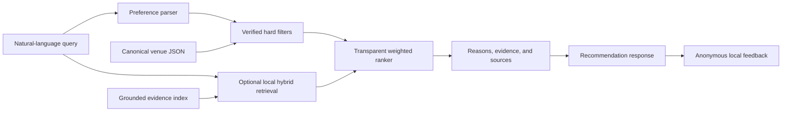

# AI Recommendation Engine

A standalone FastAPI service for finding London pubs from natural-language requests.

The engine combines verified venue facts, hard filters, transparent weighted ranking, and optional
local semantic retrieval. It is designed to recommend from evidence rather than inventing venue
features or predicting an individual user's taste.

## What works now

- Natural-language pub search through `POST /recommendations`
- Recognition of location, price, food, outdoor seating, sports, live music, DJs, events, dogs,
  wheelchair access, reservations, atmosphere, and party size
- Hard filtering for explicit requirements and exclusions
- Required, preferred, and excluded feature parsing with contradiction warnings
- Transparent ranking using distance, features, price, group suitability, rating, and popularity
- Optional local hybrid RAG using dense embeddings and lexical relevance
- Source-backed evidence and URLs in recommendation responses
- FSQ and OpenStreetMap import, matching, review, provenance, and canonical-data tooling
- Bounded official-website scanning and passage extraction
- Anonymous local interaction feedback through `POST /feedback`
- A guarded offline learning-to-rank experiment that is not used by the live API
- A local browser interface at `/` and OpenAPI documentation at `/docs`
- Traceable parser, ranker, dataset, and index versions in every recommendation response

The default checkout uses 15 fictional sample venues. The generated Westminster dataset, local
embedding model, vector index, feedback database, and evaluation reports live under ignored
`data/local/` paths and are not committed.

## Latest local metrics

The 2026-08-12 local build combines 183 Westminster venues and 225 Camden venues. The v6 suite is
retained as a continuity check across data rebuilds. It is no longer an independent holdout after a
general contrast-scope defect exposed by the expanded data was corrected; a future generalisation
claim requires a new suite frozen before further parser changes.

| Evaluation | Cases | Precision@5 | Recall@5 | Hit rate | MRR | NDCG@5 | Evidence coverage |
|---|---:|---:|---:|---:|---:|---:|---:|
| Combined Westminster + Camden, v6 | 45 | 87.56% | 45.27% | 88.89% | 89.21% | 84.67% | 97.14% |
| Westminster only, v6 | 45 | 87.56% | 60.29% | 91.11% | 88.22% | 84.73% | 92.86% |
| Camden structured smoke suite | 12 | 100.00% | 9.63% | 100.00% | 100.00% | 96.78% | n/a |

The Camden suite is intentionally small and data-backed, so its 100% precision is not evidence of
100% generalisation. Its low Recall@5 occurs because each query has many relevant venues while the
evaluator returns at most five. The combined v6 result is useful as a continuity metric, but a new
independent holdout is required before making a generalisation claim.

The larger constraint is verified attribute coverage, not ranking precision:

| Verified field | Known venues | Dataset coverage |
|---|---:|---:|
| Outdoor seating | 202 / 408 | 49.51% |
| Food | 167 / 408 | 40.93% |
| Wheelchair accessibility | 61 / 408 | 14.95% |
| Dog friendly | 20 / 408 | 4.90% |
| Live music | 20 / 408 | 4.90% |
| Reservations | 18 / 408 | 4.41% |
| Sports | 16 / 408 | 3.92% |
| Group suitability | 11 / 408 | 2.70% |
| DJ | 6 / 408 | 1.47% |
| Events | 7 / 408 | 1.72% |

There are 152 manually verified official websites (37.25% of venues), and grounded passages were
successfully extracted for 128 venues (31.37%). Unknown values are never treated as `false`, so
improving these figures directly increases useful coverage without weakening precision. The
latest machine-readable snapshot is in `data/audits/sqlite_events_metrics_2026-08-12.json`.

The live application database now contains all 408 canonical venue rows as well as evidence,
binary vectors, FTS5 search, anonymous feedback, and the human feature-review queue. JSON remains
as a reproducible import/export and audit format, not a second live store.

## Quick start

Requires Python 3.12 and [uv](https://docs.astral.sh/uv/).

For this working copy, use the included launcher. It automatically uses the full 408-venue
SQLite/FTS5 database when the local files exist and otherwise starts the sample demo:

```bash
./run.sh
```

Then open `http://127.0.0.1:8000/`. If port 8000 is already occupied, run
`PORT=8001 ./run.sh` and open `http://127.0.0.1:8001/` instead.

For a fresh clone, install dependencies first:

```bash
git clone https://github.com/jodieorogun/ai-recommendation-engine.git
cd ai-recommendation-engine
uv sync --extra dev
uv run uvicorn app.main:app --reload
```

Open:

- Browser interface: `http://127.0.0.1:8000/`
- Swagger/OpenAPI: `http://127.0.0.1:8000/docs`
- Health check: `http://127.0.0.1:8000/health`
- Readiness check: `http://127.0.0.1:8000/ready`

The default server uses `data/sample_venues.json` and deterministic ranking. See
[Run with Westminster RAG](#run-with-westminster-rag) to enable the local embedding index.

## Architecture



The API depends on a `VenueRepository` interface rather than a storage implementation. Canonical
venue rows are validated from JSON once at startup, while RAG documents and vectors stay in SQLite
and are fetched only for the current candidate IDs. SQLite FTS5 supplies bounded lexical matches;
the service does not deserialize the complete evidence index into memory. PostgreSQL or PostGIS can
replace either repository later without changing the parser, filters, ranker, or API contract.

## How a recommendation is produced

1. The parser converts supported query phrases into structured preferences.
2. Explicit requirements are applied as hard filters. Unknown values never count as confirmed.
3. Remaining venues receive a deterministic score using only available signals.
4. When RAG is enabled, the query is compared with attributable evidence chunks.
5. Results are reranked and returned with factual reasons, retrieved evidence, and source URLs.

For example:

```text
pub for 5 people in Westminster with food and sports
```

This requires verified Westminster, food, and sports data. Party size activates a softer group
suitability preference; it is not treated as an invented capacity guarantee.

### Deterministic ranking

| Factor | Weight | Used when |
|---|---:|---|
| Location | 0.25 | An area is requested |
| Features | 0.20 | A supported feature or atmosphere is requested |
| Rating | 0.20 | A verified rating is available |
| Price | 0.15 | A price level is requested |
| Group suitability | 0.10 | A group requirement is detected |
| Popularity | 0.10 | A verified popularity score is available |

Only active, known factors participate in the denominator. Missing ratings, prices, or amenities
are omitted rather than silently treated as bad values. Distance uses the Haversine distance from
the requested area's configured centre.

### Hybrid RAG ranking

RAG uses the local `BAAI/bge-small-en-v1.5` model through FastEmbed. It does not make a paid API
call and it is not an LLM chat layer.

- Retrieval score: 90% dense semantic similarity and 10% query-term coverage, selected against
  lexical-only and semantic-only baselines on the versioned evaluation set
- Final score with structured evidence: 75% deterministic score and 25% retrieval score
- Free-form queries, or queries with no usable deterministic signal: retrieval score only

Structured hard filters always run before semantic reranking. RAG can retrieve descriptions such
as “historic” or “traditional,” but it cannot override an explicit verified requirement.

## API

### `POST /recommendations`

```bash
curl -X POST http://127.0.0.1:8000/recommendations \
  -H 'Content-Type: application/json' \
  -d '{"query":"historic pub near Parliament","limit":5}'
```

The response contains:

- `parsedPreferences`: supported preferences and any `unparsedTerms`
- `retrievalMode`: `deterministic` or `hybrid_rag`
- `recommendations`: ranked venues with scores and contact details
- `reasons`: explanations produced from structured fields
- `evidence`: retrieved grounded passages when RAG is active
- `evidenceSources` and `evidenceSourceUrls`: provenance for those passages
- `requestId`, parser/ranking versions, and dataset/index versions for reproducibility
- `activePreferences` and `ignoredPreferences`: signals that did or could not affect ranking
- `warnings` and `noResultReasons`: unsupported terms, conflicts, and verified data gaps
- `scoreBreakdown`: transparent contributions to each result's ranking score
- `offset`, `limit`, `totalAvailable`, and `hasMore`: stable five-result pagination metadata

An unsatisfied hard requirement returns an empty `recommendations` array. The API does not relax
the request by pretending that an unknown venue attribute is a match.

Feature wording determines constraint strength. For example, `with sports` is required,
`prefer sports` is a soft ranking preference, and `no sports` requires verified evidence that the
venue does not show sports. Contradictory wording returns no results with an explanation instead
of choosing one interpretation silently.

### `POST /feedback`

```bash
curl -X POST http://127.0.0.1:8000/feedback \
  -H 'Content-Type: application/json' \
  -d '{
    "venueId":"fsq-PLACE_ID",
    "eventType":"like",
    "query":"historic pub near Parliament",
    "recommendationRank":1,
    "sessionId":"anonymous-session"
  }'
```

Supported events are `impression`, `click`, `save`, `like`, and `dislike`. Browser events include
the request, ranking, and dataset versions so offline evaluation can reproduce their context. Events are stored in
ignored `data/local/feedback.sqlite3` by default. The endpoint does not request a name, email
address, or other direct personal identifier.

## Configuration

| Variable | Default | Purpose |
|---|---|---|
| `VENUE_DATA_PATH` | `data/sample_venues.json` | Active validated venue dataset |
| `APP_DATABASE_PATH` | unset | Unified SQLite venues, evidence, vectors, FTS, feedback, and review queue |
| `FEEDBACK_DB_PATH` | `data/local/feedback.sqlite3` | Local SQLite feedback store |
| `RAG_INDEX_PATH` | unset | Enables RAG using the supplied SQLite evidence database |
| `RAG_MODEL_CACHE_PATH` | FastEmbed default | Local embedding-model cache |
| `OLLAMA_MODEL` | unset | Enables the free local structured parser, for example `qwen2.5:3b` |
| `OLLAMA_BASE_URL` | `http://127.0.0.1:11434` | Local Ollama endpoint; non-loopback URLs are rejected |
| `OLLAMA_TIMEOUT_SECONDS` | `8` | Local parser request timeout before semantic fallback |
| `FSQ_API_KEY` | unset | FSQ import credential; keep it in ignored `.env` |

## Run with Westminster RAG

This assumes the local canonical dataset has already been built at
`data/local/westminster_venues_enriched.json`.

Install the optional dependency:

```bash
uv sync --extra dev --extra rag
```

Extract text only from websites whose provenance explicitly identifies them as official:

```bash
uv run python -m app.source_enrichment.website_passage_ingester \
  data/local/westminster_venues_enriched.json \
  data/local/westminster_website_passages.json \
  --pages-per-venue 2 \
  --passages-per-venue 12 \
  --delay-seconds 0.1
```

The ingester respects `robots.txt`, stays on the verified host, does not execute JavaScript, and
removes navigation, advertising, review/testimonial containers, and repeated operator boilerplate.
Unverified FSQ website URLs are excluded because they may point to directories or review sites.

Build the local evidence database:

```bash
uv run --extra rag python -m app.rag.venue_index \
  data/local/westminster_venues_enriched.json \
  data/local/westminster_evidence.sqlite3 \
  --website-passages data/local/westminster_website_passages.json \
  --cache data/local/models
```

The SQLite database stores each document once and keeps embeddings as compact binary vectors. The
first build downloads the embedding model into the ignored local cache. Rebuild it whenever source
data changes. The API rejects evidence whose venue-data hash is stale. Legacy JSON indexes can
still be loaded for migration, but new builds should use `.sqlite3`.

Start the server:

```bash
VENUE_DATA_PATH=data/local/westminster_venues_enriched.json \
RAG_INDEX_PATH=data/local/westminster_evidence.sqlite3 \
RAG_MODEL_CACHE_PATH=data/local/models \
uv run --extra rag uvicorn app.main:app --reload
```

### Optional free local structured parser

For stronger paraphrase and negation handling without a paid API, install Ollama locally and pull
an instruction model once:

```bash
ollama pull qwen2.5:3b
```

Then add `OLLAMA_MODEL` when starting the RAG server:

```bash
VENUE_DATA_PATH=data/local/westminster_venues_enriched.json \
RAG_INDEX_PATH=data/local/westminster_evidence.sqlite3 \
RAG_MODEL_CACHE_PATH=data/local/models \
OLLAMA_MODEL=qwen2.5:3b \
uv run --extra rag uvicorn app.main:app --reload
```

The parser sends queries only to a loopback HTTP address and accepts only a validated JSON schema.
It runs at temperature zero, preserves deterministic rule matches, and treats contradictory
requirements as no-result queries. If Ollama is stopped, times out, lacks the configured model, or
returns invalid output, the existing semantic parser is used automatically. No API key, account,
or paid service is involved.

This layer remains opt-in. The guarded `qwen2.5:3b` parser improved the untouched v7 suite from
84.44% to 88.89% precision, but tied the semantic parser at 82.33% on the subsequent untouched v8
suite. The tracked local-LLM audit records both results and the higher development-only score so it
cannot be mistaken for independent generalisation. Do not accept the extra latency as a production
trade-off until a larger or better-trained local model wins on a new frozen suite.

## Evaluate retrieval

The active development suite lives in `data/evaluation/regression/`. Historical development and
consumed holdout suites live under `data/evaluation/archive/`; they are retained for provenance,
not used by the application. Run the archived mixed 101-case suite only for historical comparison:

```bash
uv run --extra rag python -m app.rag.evaluate_retrieval \
  data/local/westminster_venues_enriched.json \
  data/local/westminster_evidence.sqlite3 \
  data/evaluation/archive/development/queries_101.json \
  data/local/historical_queries_101_evaluation.json \
  --cache data/local/models
```

To benchmark the local structured parser, append `--ollama-model qwen2.5:3b`. The generated report
records the active intent-parser version so local-LLM and semantic-fallback results remain distinct.

The evaluator follows the same precision-first path as the API: it parses explicit requirements,
keeps only venues with verified matching attributes, and then applies semantic ranking. It never
uses the relevance judgments to choose candidates and does not pad a short verified result set with
unknown venues.

The report includes precision, traditional recall, and capacity-adjusted recall at configurable
cutoffs. Use `--cutoffs 1,3,5,10,20` to calculate Recall@X. Capacity-adjusted recall divides by
`min(X, relevant venues)`, showing whether the available result slots were used well without
pretending a five-result page can retrieve hundreds of relevant venues. Reports also include hit
rate, mean reciprocal rank, NDCG, evidence-term coverage, relevance grades, and retrieved evidence.
The versioned suite contains 101 structured,
multi-constraint, and manually judged subjective queries. A failed subjective case represents a
data or retrieval gap; it is not permission to manufacture supporting evidence.

### Free Ragas evidence evaluation

Add `--ragas-evidence` to calculate evidence-layer Context Precision and Context Recall using
Ragas' ID-based metrics:

```bash
uv run --extra rag python -m app.rag.evaluate_retrieval \
  data/local/westminster_camden_venues_enriched.json \
  data/local/westminster_camden_evidence.sqlite3 \
  data/evaluation/regression/queries_300.json \
  data/local/westminster_camden_ragas_evidence_regression_300_clean.json \
  --cache data/local/models \
  --cutoffs 1,3,5,10,20 \
  --ragas-evidence
```

This mode is deterministic and free: it compares stable retrieved chunk IDs with exact reference
chunk IDs derived from verified venue attributes and expected evidence terms. It does not configure
an evaluator LLM, use an API key, or make paid model calls. The optional Ragas dependency is kept
inside the `rag` extra.

The cleaned 300-case run evaluates 236 non-empty-reference cases and scores 88.10% ID Context
Precision and 88.98% ID Context Recall, up from 29.69% and 34.81%. The v6 continuity suite scores
91.21% and 92.31%. Retrieval now prefers chunks tagged with the parsed requested attributes and
does not expose unrelated identity/address chunks as supporting evidence. References are scoped to
the product's top-five results and exact requested claims. Complete venue misses remain in the
Ragas aggregate as zero-score cases, preventing survivorship bias. Sixty-five expected-empty cases
remain excluded because successful abstention has no reference evidence to retrieve.

### Balanced 300-case regression suite

The deterministic regression suite contains exactly 300 unique queries across all nine structured
features: 126 positive single-feature paraphrases, 72 explicit negatives, 54 positive
multi-constraint requests, 18 mixed required/excluded requests, and 30 contradictions. It includes
both positive and negative accessibility language, such as `step-free access` and
`no step-free access`.

```bash
uv run --extra rag python -m app.rag.evaluate_retrieval \
  data/local/westminster_camden_venues_enriched.json \
  data/local/westminster_camden_evidence.sqlite3 \
  data/evaluation/regression/queries_300.json \
  data/local/westminster_camden_regression_300.json \
  --cache data/local/models \
  --cutoffs 1,3,5,10,20
```

After feature expansion, the suite scores 88.00% Precision@1, 87.56% Precision@3, and 87.33%
Precision@5. Traditional recall rises from 36.34% at one result to 52.34% at five and 67.58% at
twenty. Capacity-adjusted recall is 88.00% at one and 83.77% at five. This is a transparent-template
development regression suite, not an untouched holdout. Its results can guide fixes, but
independent generalisation claims require a new suite frozen before those fixes.

### Held-out generalisation check

The consumed holdout suites v1-v8 and their checksum manifests are archived in
`data/evaluation/archive/holdouts/`. They are historical evidence, not untouched tests anymore.
Create `data/evaluation/current_holdout/` for the next genuinely unseen suite and move it into the
archive as soon as its failures influence development.

For historical reproduction, v6 can still be run separately:

```bash
uv run --extra rag python -m app.rag.evaluate_retrieval \
  data/local/westminster_venues_enriched.json \
  data/local/westminster_evidence.sqlite3 \
  data/evaluation/archive/holdouts/holdout_v6.json \
  data/local/historical_holdout_v6_evaluation.json \
  --cache data/local/models
```

The holdout includes new single-feature paraphrases, multi-constraint requests, negative wording,
contradictions, and subjective searches. Negative cases count only verified `false` values as
matches; unknown venue fields are never accepted as evidence for a negative claim.

When RAG is enabled, the API also loads a local semantic intent parser. It combines concise feature
prototypes with packaged, venue-independent training examples, then applies deterministic negation
scope before hard filtering. Generic and subjective examples act as a none-of-the-above class so a
mood request is less likely to become an unsupported amenity requirement. The API reports this as
`rules-v3+semantic-intents-v3` in `parserVersion`.

The latest independent Westminster-only objective check is
`grounded-rag-holdout-v6-objective-final`: 45 new queries,
87.56% precision at K, 91.11% hit rate, 84.73% NDCG at K, and 92.86% evidence-term coverage. The
tracked audit records the category breakdown. This is deliberately reported separately from the
higher development scores and from subjective cases whose sparse judgments need additional human
review.

## Westminster data pipeline

Generated source data and reports stay in ignored `data/local/`. Reviewed corrections belong in
the tracked override file so they are applied on every rebuild.

### 1. Import FSQ pubs

Store `FSQ_API_KEY` in ignored `.env`, then run a bounded grid import:

```bash
uv run python -m app.source_import.fsq_grid_importer \
  --bbox '51.483,-0.205,51.538,-0.109' \
  --category-ids '4bf58dd8d48988d11b941735' \
  --rows 3 \
  --columns 3 \
  --output data/local/fsq_westminster_pubs_grid.json
```

### 2. Import OSM pubs

```bash
uv run python -m app.source_import.osm_importer \
  --area 'City of Westminster' \
  --amenity pub \
  --output data/local/osm_westminster_pubs_enriched.json
```

OSM nodes, ways, and relations are normalised without replacing missing values with guesses. When
displaying OSM-derived data, retain [OpenStreetMap attribution](https://www.openstreetmap.org/copyright).

The local interface uses Leaflet and the standard OpenStreetMap tile layer to show roads,
neighbourhoods, stations, and landmarks behind recommendation markers. It needs an internet
connection for the map tiles, but it does not need an API key or paid map account. The standard OSM
tile service is suitable for this local demo; a production deployment should choose a tile provider
or self-hosting setup that matches its expected traffic and the
[OSM tile usage policy](https://operations.osmfoundation.org/policies/tiles/).

### 3. Apply the exact boundary and match sources

```bash
uv run python -m app.source_matching.boundary_filter \
  data/local/fsq_westminster_pubs_grid.json \
  data/local/city_of_westminster_boundary.geojson \
  data/local/fsq_westminster_pubs_in_boundary.json

uv run python -m app.source_matching.source_matcher \
  data/local/fsq_westminster_pubs_in_boundary.json \
  data/local/osm_westminster_pubs_enriched.json \
  data/local/westminster_source_match_report_boundary.json

uv run python -m app.source_matching.review_report \
  data/local/fsq_westminster_pubs_in_boundary.json \
  data/local/osm_westminster_pubs_enriched.json \
  data/local/westminster_source_match_report_boundary.json \
  data/local/westminster_manual_review.json
```

Matching uses normalised names, distance, postcode, website domain, and telephone number. Only
high-confidence unique pairs are accepted automatically; uncertain pairs remain reviewable.

### 4. Verify official website URLs

FSQ and OSM website fields are candidates, not automatically trusted official sources. Run the
identity verifier to reject directories, generic operator homepages, dead URLs, and pages that do
not identify the venue. Review the audit report before retaining changes to the tracked
verification file.

```bash
uv run python -m app.source_enrichment.official_url_verifier \
  data/local/westminster_venues_enriched.json \
  data/local/westminster_official_url_audit.json \
  data/overrides/westminster_official_website_verifications.json \
  --verified-at 2026-08-10
```

Verification requires multiple independent identity signals from the final URL, page title,
heading, visible text, or an existing tracked official-evidence domain. Redirects and all rejected
URLs remain visible in the local audit report.

### 5. Resolve reviews and build canonical venues

```bash
uv run python -m app.source_matching.review_resolution \
  data/local/westminster_source_match_report_boundary.json \
  data/local/westminster_review_decisions.json \
  data/local/westminster_source_match_report_resolved.json

uv run python -m app.data_pipeline.canonical_venue_builder \
  data/local/fsq_westminster_pubs_in_boundary.json \
  data/local/osm_westminster_pubs_enriched.json \
  data/local/westminster_source_match_report_resolved.json \
  data/local/westminster_venues_enriched.json \
  --area Westminster \
  --verified-at 2026-08-08 \
  --overrides data/overrides/westminster_venue_overrides.json \
  --official-websites data/overrides/westminster_official_website_verifications.json \
  --feature-review data/audits/westminster_passage_feature_review_2026-08-10.json
```

Canonical records retain field-level source, source-record ID, verification date, and confidence.
Unknown facts remain `null`. FSQ is the primary source; OSM fills only supported observable gaps;
reviewed official-site corrections are applied through the tracked override file.

### 6. Review website feature evidence

```bash
uv run python -m app.source_enrichment.official_website_scanner \
  data/local/westminster_venues_enriched.json \
  data/local/westminster_website_feature_review.json \
  --venue-ids-file data/audits/westminster_top20_2026-08-08.json
```

This report suggests feature corrections for manual review. It never edits canonical facts
automatically.

Grounded passages can also produce a deduplicated structured-feature review queue:

```bash
uv run python -m app.source_enrichment.passage_feature_review \
  data/local/westminster_venues_enriched.json \
  data/local/westminster_website_passages.json \
  data/audits/westminster_passage_feature_review_2026-08-10.json \
  --reviewed-at 2026-08-10
```

Only entries explicitly marked `approved` are applied during the next canonical build through
`--feature-review`. Rejected and pending entries remain inert but auditable.

## Camden expansion and multi-borough index

Camden uses OSM administrative relation `51827`. Its exact polygon belongs in ignored
`data/local/london_borough_of_camden_boundary.geojson`; generated borough datasets remain local.
The FSQ grid importer now paces requests and retries HTTP 429 responses with a bounded backoff.
When the FSQ allowance is unavailable, an explicit OSM-only canonical build can proceed without
changing the default FSQ-primary behavior:

```bash
uv run python -m app.data_pipeline.canonical_venue_builder \
  data/local/fsq_camden_pubs_in_boundary.json \
  data/local/osm_camden_pubs_enriched.json \
  data/local/camden_source_match_report_osm_only.json \
  data/local/camden_venues_enriched.json \
  --area Camden \
  --verified-at 2026-08-12 \
  --include-unmatched-osm \
  --official-websites \
    data/local/camden_official_website_verifications.json \
    data/overrides/camden_official_website_verifications.json \
  --feature-review \
    data/audits/camden_passage_feature_review_2026-08-11.json \
    data/audits/camden_music_events_feature_review_2026-08-12.json
```

Combine validated borough records, then build one hash-bound SQLite evidence database directly
from the two borough passage reports:

```bash
uv run python -m app.data_pipeline.dataset_combiner venues \
  data/local/westminster_camden_venues_enriched.json \
  data/local/westminster_venues_enriched.json \
  data/local/camden_venues_enriched.json

uv run --extra rag python -m app.rag.venue_index \
  data/local/westminster_camden_venues_enriched.json \
  data/local/westminster_camden_evidence.sqlite3 \
  --website-passages \
    data/local/westminster_website_passages.json \
    data/local/camden_website_passages.json \
  --cache data/local/models
```

The 2026-08-12 build records 225 Camden OSM venues, 54 verified official websites, 276 Camden
website passages, and a combined 408-venue database. The passage review approved 31
explicit official-site facts and rejected two insufficient claims. Explicit OSM tags then added 77
known music, dog, accessibility, and reservation values, including explicit negative values rather
than treating unknown as false. The new review also keeps live music, DJs, and general event
programmes as separate facts. The database represents explicit negative facts as grounded chunks,
retains vectors as compact binary values, and exposes its active backend through `/ready`.

The latest official-site verification also confirms recurring event programmes at The Black Heart
and The Fiddler's Elbow. This raises verified event coverage from five to seven pubs. The local
review page at `/review` shows only still-unknown claims, quotes their evidence, and requires an
explicit approve/reject decision. Decisions do not change recommendations until they are exported,
audited, and included in the next canonical rebuild.

### Five-feature expansion (2026-08-13)

The first expansion after the discovery-feed redesign adds happy hour, Sunday roast,
vegan/vegetarian options, quiz night, and accessible toilet as independent, nullable facts. Each
supports required, preferred, and negated natural-language queries. In particular, an accessible
toilet no longer implies a step-free entrance, and unknown values are never treated as negatives.

A bounded, robots-aware refresh targeted 31 verified official venue sites that were missing from
the existing passage corpus. Twelve sites yielded 41 pages; 19 remained untouched after robots or
HTTP failures. The reviewed high-precision batch currently verifies two happy hours, six Sunday
roasts, three vegan offerings, three quiz programmes, and one accessible toilet. Broader candidate
claims remain on the local `/review` page instead of entering recommendations automatically. The
tracked decisions and their evidence URLs live in
`data/audits/five_new_features_verified_2026-08-13.json`.

### Performance baseline

```bash
uv run --extra rag python -m app.benchmark \
  data/local/westminster_camden_evidence.sqlite3 \
  data/local/database_native_benchmark.json \
  --iterations 5
```

The 2026-08-12 local baseline over 25 requests records 1.51 s startup, 74.0 ms median latency,
126.6 ms p95 latency, and 556.6 MB peak resident memory. The local embedding runtime now dominates
memory; evidence and canonical documents remain in SQLite until the current candidate set needs
them.

### Local artifact retention

Keep the current enriched borough datasets, exact boundaries, resolved match reports, review
decisions, borough passage reports, final evaluation reports, and the active evidence database.
Earlier raw import
variants and superseded generated evaluation reports can be regenerated and should be moved out of
`data/local/` once their final metrics have been copied into a tracked `data/audits/` record.
Never remove frozen evaluation query files or manifests: they preserve the independence and
checksum history of held-out tests.

## Offline feedback ML

The optional experiment trains logistic regression only from explicit likes and dislikes. It does
not treat impressions as dislikes, use recommendation rank as a feature, create personal profiles,
or alter live API results.

```bash
uv sync --extra ml
uv run --extra ml python -m app.ml.offline_experiment \
  data/local/feedback.sqlite3 \
  data/local/westminster_venues_enriched.json \
  data/local/ml_training_examples.csv \
  data/local/ml_experiment_report.json
```

Deployment is gated until there are at least 100 explicit labels, including 20 likes, 20 dislikes,
and 10 parsed preference groups. The report records whether those conditions are satisfied. No
model artifact is written while the experiment is below that threshold.

## Tests and CI

```bash
uv sync --extra dev --extra ml --extra rag
uv run ruff check .
uv run mypy app tests
uv run pytest
```

Pytest enforces at least 90% application coverage. GitHub Actions runs Ruff, strict Mypy, and the
complete test suite on pushes and pull requests, installing the `dev`, `ml`, and `rag` extras.
The 2026-08-12 local validation passes 210 tests at 90.13% coverage, plus Ruff, strict Mypy, JSON,
lockfile-consistency, and whitespace checks.

## Local accounts and personal pub diaries

The first personalisation layer is deliberately local and free:

- create an account with an email, display name, and password;
- mark a pub as visited and optionally rate it from one to five stars;
- keep a private diary note and optional photo for each visit;
- update an existing rating without creating duplicate diary entries;
- boost pubs sharing verified traits with places rated four or five stars;
- see why a result was personalised without hiding its normal evidence.
- see a weekly visit count, average rating, and London dataset discovery percentage.

Passwords use salted `scrypt` hashes. Session credentials are random, stored as hashes, and sent
in an HttpOnly, SameSite cookie. A public deployment should add HTTPS, CSRF protection, rate
limiting, email verification, password reset, and a production identity provider. Google sign-in
can later map its verified identity to the existing user ID while leaving ratings unchanged.
Diary notes and photos are private account data: photo responses require the owner's session and
use private caching. Friend connections and public reviews are intentionally not implemented yet.
Personal data is stored in `data/local/accounts.sqlite3`, separately from the rebuildable venue
and evidence database. Set `ACCOUNT_DB_PATH` to choose a different private database location.

Personal vibe explanations require at least 95% overlap across known verified traits. Pricing uses
one comparable London benchmark: a full pint of draught Guinness is cheap below £4, expensive
above £7, and moderate otherwise. Other beers are never substituted because their prices are not
directly comparable. The robots-aware official-site scanner checks verified HTML and PDF menus and
publishes only unambiguous Guinness findings directly into the local enrichment database; bottles, cans,
half-pints, Guinness 0.0, unclear servings, and price-free mentions are excluded.
When no grounded price is found, `/review` offers a small manual fallback for the exact Guinness
pint price and its evidence URL; the application derives the band automatically. Set
`PRICE_DB_PATH` to relocate these generated and manually verified observations.

The optional directory importer increases coverage with conservative identity matching. It first
tries compatible name plus exact postcode, then accepts only unambiguous name plus close
coordinates, venue-specific website, or street address. Only explicit Guinness prices qualify.
These prices remain linked
and are labelled as community-reported in the interface; they are not represented as official-menu
observations or silently mixed with official evidence.

```bash
uv run python -m app.source_enrichment.pint_price_directory_importer \
  data/local/westminster_camden_venues_enriched.json \
  data/local/price_observations.sqlite3 \
  data/local/pint_price_directory_import.json
```

```bash
uv run python -m app.source_enrichment.guinness_price_scanner \
  data/local/westminster_camden_venues_enriched.json \
  data/local/guinness_price_scan.json \
  --database data/local/price_observations.sqlite3
```

## Project structure

```text
app/
  api/                 FastAPI routes
  data_pipeline/       Validation and canonical venue construction
  ml/                  Guarded offline ranking experiment
  models/              Venue, account, feedback, and provenance models
  parsing/             Natural-language preference extraction
  rag/                 Local index, retrieval, and evaluation
  ranking/             Transparent venue scoring
  repositories/        Venue, account, rating, and feedback storage
  retrieval/           Hard candidate filters
  services/            Recommendation and feedback orchestration
  source_enrichment/   Official-site evidence tools
  source_import/       FSQ and OSM clients
  source_matching/     Boundary, matching, and manual-review tools
  web_assets/          Local browser interface
data/
  audits/              Tracked review scopes
  overrides/           Tracked evidence-backed corrections
  source_samples/      Fictional source-matching examples
  local/               Ignored generated data, indexes, models, and reports
tests/                 Unit and integration tests
```

## Docker

The image starts the deterministic sample-data API:

```bash
docker build -t ai-recommendation-engine .
docker run --rm -p 8000:8000 ai-recommendation-engine
```

Mount venue data and configure environment variables separately when running the Westminster or
RAG setup in a container.

## Current limitations

- Westminster outputs are generated locally and are not distributed with the repository.
- Official-site RAG coverage is limited to URLs whose provenance has been manually verified.
- Ratings, price, atmosphere, accessibility, and event information remain incomplete for many pubs.
- RAG retrieves evidence but does not use an LLM to generate prose answers.
- Personalisation currently uses a small explainable similarity boost, not collaborative filtering.
- Local accounts are not yet hardened for a public internet deployment.
- There is no hosted deployment or PostgreSQL database.

## Next priorities

1. Build a larger manually judged query evaluation set and add retrieval regression thresholds.
2. Verify more official venue websites and expand attributable RAG coverage.
3. Improve price, accessibility, atmosphere, and event data quality.
4. Add geospatial radius and landmark search without weakening verified constraints.
5. Introduce PostgreSQL/PostGIS when local JSON becomes an operational constraint.
6. Add an optional grounded response generator only after retrieval quality is stable.
7. Add Google OpenID Connect and harden authentication before public deployment.
8. Evaluate collaborative recommendations after collecting representative multi-user data.
